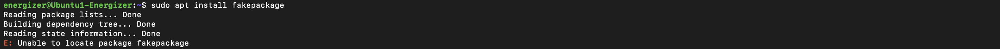
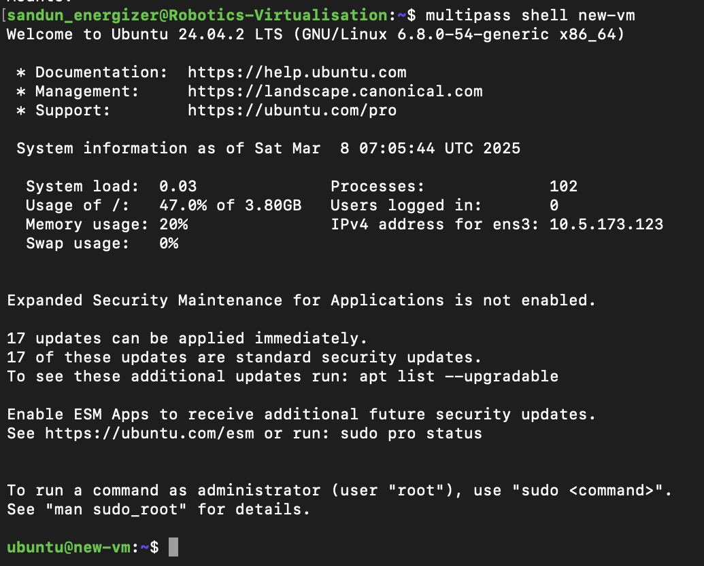

# Linux Management
This repository is for tracking the weekly progress of the Linux Management course in ICT Robotics (BEIRP24A6).

## Assignment 1: Setting Up an Azure Virtual Machine

### Initial Configuration
- Used my existing GitHub account.
- Added my HAMK student email to my GitHub account under Settings > Emails.

### Azure Account Configuration
- Signed up for an Azure account using my HAMK student email at [portal.azure.com](https://portal.azure.com).
- Activated the Azure for Students subscription to gain extra credits.

### Virtual Machine Setup
- **Machine Details:**
  - Image: Ubuntu Server 24.04 LTS gen 2 (Canonical)
  - Name: Ubuntu1-Energizer
  - Size: Standard_B2ls_v2
  - Authentication: SSH key
  - Network: Created a new resource group and subnet
  - Security: Set up to allow SSH traffic from a specific IP

  

### Establishing SSH Connection with Terminal 
- **Connecting via SSH:**
  - Entered to the Native SSH in the Azure portal to connect with the VM
  - Copied the SSH key location to Azzure  and created connecting links using Azure.
  - Launched Terminal.
  - Entered the VM's private key link.
  - Successfully connected to the VM with the specified username.

  

### Verifying the Connection
- Logged into the Ubuntu VM shell successfully.
- Confirmed system access and basic functionality.
- Left system settings at their defaults as instructed.

### Notes
- VM created according to the specifications of the Microsoft Azure course.
- Followed all security best practices.
- Used SSH key authentication for enhanced security.

## Assignment 2: List and append

- Selected five level 2 directories and save their contents in one file, "listing.md"

```sudo ls /etc/{security,selinux,systemd,sos,ssh} > listing.md```

- Listed the files

```cat listing.md```


## Assignment 3: User management and file system access

1. Created the Tupu user using the adduser script:

```sudo adduser tupu```


2. Created the Lupu user using the useradd command. Try to create a user profile, home directory, and user group similar to Tupu.

```sudo useradd -m -d /home/lupu -s /bin/bash -U lupu lupu```


3. Created the Hupu system user with the login shell set to /bin/false

```sudo useradd --system --shell /bin/false hupu```


4. Add the users Tupu and Lupu to the sudo users

```sudo visudo```

and added the folllowing lines

```tupu ALL=(ALL:ALL) ALL```
```lupu ALL=(ALL:ALL) ALL```


And added users to the sudo group with following code:

```sudo usermod -aG sudo tupu```
```sudo usermod -aG sudo lupu```


5. Created a directory /opt/projekti and add both users (Tupu and Lupu) as owners. Only Tupu and Lupu should have access to list files in the directory, read, and modify them.


6. Verified the process


## Assignment 5: Scripting and Cron
In this assignment, we developed a shell script named **print.sh** to log the size of the home directory along with the current date and time into a file called **diskspace.txt**. To automate this process, we scheduled the script to execute every 12 hours using **crontab**, ensuring it ran at least six times to generate multiple entries in the file. Finally, we used an **awk** command to identify and display the line containing the highest recorded value in the format:  
**Max=[maximum value], at [date and time]**.  

This task allowed us to efficiently track disk usage over time and identify the largest recorded value through automation.  

---

### **Step 1: Creating the Script and Scheduling It in Cron**  
We first wrote a script (**print.sh**) that appends the home directory size and timestamp to **diskspace.txt**.  

#### **Script: print.sh**  
```bash
#!/bin/bash

output=$(du -s $HOME | awk '{print $1}')  # Get home directory size  
current_datetime=$(date '+%b %d %H:%M:%S %Z %Y')  # Get current timestamp  
echo "$output $current_datetime" >> /home/energizer/diskspace.txt  # Append to file  
```


#### **Adding the Script to Cron**  
To schedule this script, we edited the crontab file using:  
```bash
crontab -e
```
Then, we added the following entry to run the script automatically every 12 hours:  
```bash
0 */12 * * * /home/energizer/print.sh
```
For testing purposes, we initially scheduled it to run every 2 minutes with:  
```bash
*/2 * * * * /home/energizer/print.sh
```


### **Step 2: Running the Script Multiple Times**  
Once the script was scheduled in **cron**, it executed automatically, adding new entries to **diskspace.txt** at each scheduled interval. We ensured that it ran at least six times to generate sufficient data for analysis.  

First time errorneously I have uploaded only after two times running the script, which the instructions were to take after six entries. 


Then I reperformed the exercise again and got the results after 6 entries.


---

### **Step 3: Extracting the Maximum Recorded Value**  
We then used the **awk** command to scan **diskspace.txt**, identify the highest home directory size, and display it along with the corresponding timestamp.  

#### **Command:**  
```bash
awk '{if($1 > max) {max=$1; line=$0}} END {print "Max=" max ", at " substr(line, index(line, $2))}' diskspace.txt
```


#### **Explanation:**  
1. **Finding the Maximum Value**  
   - `$1` represents the first column (home directory size).  
   - The `max` variable stores the highest value found so far.  
   - The `line` variable stores the entire row where the maximum value occurs.  
   - If `$1` is greater than `max`, it updates both `max` and `line`.  

2. **Extracting and Printing the Relevant Information**  
   - `END {print "Max=" max ", at " substr(line, index(line, $2))}` executes after processing all lines.  
   - `"Max=" max` outputs the highest recorded size.  
   - `index(line, $2)` determines the starting position of the timestamp in the row.  
   - `substr(line, index(line, $2))` extracts and prints the timestamp from that position onward.  

---

### **Conclusion**  
By implementing this automated system, we effectively monitored disk space usage, stored historical data, and identified the highest recorded value using **awk**. This approach provides an efficient way to track storage trends without manual intervention.


# Assignment 6: APT Usage Exploration on Linux

## Introduction
This report details practical work with the Advanced Package Tool (APT) on a Linux system, including system updates, package handling, repository management, and troubleshooting strategies.

---

## Part 1: APT Basics & System Updates

### Checking APT Version
**Command used:**
```bash
apt --version
```


### Updating Package Lists
**Command used:**
```bash
sudo apt update
```
**Significance:**
- Syncs local package lists with remote repositories.
- Ensures the system has updated details on available software.
- Necessary before installing or upgrading packages.
- Identifies which packages require updates.


### Upgrading Installed Packages
**Command used:**
```bash
sudo apt upgrade -y
```
**Key Differences Between Update and Upgrade:**
- `apt update` refreshes package metadata.
- `apt upgrade` downloads and installs newer versions of installed packages.
- `update` is like checking for updates, whereas `upgrade` applies them.


### Checking for Pending Updates
**Command used:**
```bash
apt list --upgradable
```
 This command lists upgradeble files

---

## Part 2: Installing & Managing Software

### Searching for a Package
**Command used:**
```bash
apt search image editor
```
**Selected Package:** GIMP (GNU Image Manipulation Program)

### Viewing Package Details
**Command used:**
```bash
apt show gimp
```


**Dependencies:**
- `libc6`
- `libgdk-pixbuf2.0-0`
- `libgegl-0.4-0t64`
- `libgimp2.0t64`
- `libgtk2.0-0t64`

### Installing a Package
**Command used:**
```bash
sudo apt install gimp -y
```
**Verification:** Installation was successful, and the application was launched to confirm functionality.

### Checking Installed Version
**Command used:**
```bash
apt list --installed | grep gimp
```


---

## Part 3: Uninstalling & Cleaning Packages

### Removing a Package
**Command used:**
```bash
sudo apt remove gimp -y
```
**Note:** Removes the software but retains configuration files.

### Completely Purging a Package
**Command used:**
```bash
sudo apt purge gimp -y
```
**Key Differences Between Remove and Purge:**
- `remove` uninstalls the application while keeping settings.
- `purge` deletes both the application and its configuration files.
- `purge` is ideal for completely removing all package traces.

### Removing Unused Dependencies
**Command used:**
```bash
sudo apt autoremove -y
```
**Significance:**
- Deletes packages no longer required by other applications.
- Frees up storage space.
- Helps keep the system clean.

### Clearing the Package Cache
**Command used:**
```bash
sudo apt clean
```
**Purpose:**
- Erases downloaded `.deb` files from the local cache.
- Frees space in `/var/cache/apt/archives/`.
- Does not affect installed programs.

---

## Part 4: Repository Management & Troubleshooting

### Viewing Repository Sources
**Command used:**
```bash
cat /etc/apt/sources.list
```


**Observations:**
- Includes core Ubuntu repositories.
- Contains components: main, restricted, universe, multiverse.
- Lists both source and binary repositories.
- Includes security update repositories.

### Enabling the Universe Repository
**Command used:**
```bash
sudo add-apt-repository universe
sudo apt update
```


**Universe Repository Offers:**
- Community-maintained software.
- Open-source applications not officially supported by Ubuntu.
- A broader selection of packages than the main repository.
- More frequent updates.

### Simulating an Installation Failure
**Command used:**
```bash
sudo apt install fakepackage
```
**Error Message:**


**Troubleshooting Steps:**
- Verify the package name is correct.
- Check if the repository containing the package is enabled.
- Run `apt update` to refresh package indexes.
- Use `apt search` to find similar packages.
- Look for alternative package sources if necessary.

---

## Bonus: Holding & Releasing Packages

### Preventing Automatic Updates
**Commands used:**
```bash
sudo apt-mark hold firefox
sudo apt-mark unhold firefox
```


**Reasons for Holding a Package:**
- Prevents automatic updates of essential software.
- Ensures compatibility with other installed programs.
- Avoids potential issues caused by new updates.
- Maintains a stable working environment.

---

## Conclusion
This assignment provided hands-on experience with APT package management, covering:
- Updating and upgrading the system.
- Installing and removing software.
- Managing repositories.
- Troubleshooting package issues.
- Using advanced package management techniques.

These skills are essential for effectively managing and maintaining Linux-based systems.

# Assignment 7: Virtualization
# Linux Virtualization Exercise

## Part 1: Virtualization Concepts

### Overview of Key Concepts

#### Virtualization
Virtualization enables the creation of virtual versions of hardware, storage, or networks, allowing multiple virtual systems to run on a single physical machine.

#### Hypervisor
A hypervisor, also known as a Virtual Machine Manager (VMM), is software that manages virtual machines (VMs). There are two types:

- **Type 1 (Bare Metal):** Runs directly on hardware (e.g., VMware ESXi, Xen).
- **Type 2 (Hosted):** Runs on an existing operating system (e.g., VirtualBox, VMware Workstation).

#### Virtual Machines (VMs)
Virtual Machines are isolated computing environments that include:

- Their own operating system
- Virtualized hardware like CPU, RAM, storage, and networking
- Independence from other VMs on the same host

#### Containers
Containers are lightweight environments bundling an application and its dependencies. They:

- Share the host's kernel
- Are more resource-efficient compared to VMs
- Have faster startup times and greater portability

#### Comparison: VMs vs. Containers

| Feature           | Virtual Machines (VMs)       | Containers                |
|--------------------|------------------------------|---------------------------|
| **Architecture**   | Fully isolated, each with its own OS | Shared kernel, isolated spaces |
| **Resource Usage** | High (OS per VM)            | Low (shared host OS kernel)|
| **Isolation**      | Complete isolation          | Process-level separation  |

---
## Part 2: Working with Multipass

### Setting It Up
To install:

```
sudo snap install multipass
```

### Core Commands

#### Create a default Ubuntu VM

```multipass launch --name new-vm```

#### Show list of active instances

```multipass list```


#### View details of a VM

```multipass info new-vm```


#### Open the VM's shell

```multipass shell new-vm```



#### Run a command in the VM

```multipass exec new-vm -- ls -la```


#### Suspend the VM

```multipass stop new-vm```

#### Remove the VM

```multipass delete new-vm```


#### Configuring with Cloud-init


To begin an instance with pre-set configuration, save the settings in a file (e.g., `cloud-config`):

```multipass launch --name new-instance --cloud-init cloud-init```


### Sharing Files

##### Create a directory on your host system
```mkdir ~/share-folder```

##### Attach it to the instance
```multipass mount ~/share-folder configured-vm:/shared-data```


## Part 3 : LXD Implementation

### Set up a container with Ubuntu

```lxc launch ubuntu:20.04 new-container```

### Display running containers

```lxc list```

### Execute commands inside the container

```lxc exec new-container -- apt update```

### Stop and delete the container
```Bash
lxc stop sample-container
lxc delete sample-container
```


## Part 4 : Docker Implementation

Installation Steps
```Bash
sudo apt update
sudo apt install docker.io
sudo systemctl start docker
sudo systemctl enable docker
```
### Basic docker commands

#### Download an Ubuntu container image

```docker pull ubuntu:latest```

#### Run a container interactively

```docker run -it ubuntu:latest```

#### Check active containers

```docker ps```

#### Build an image from a Dockerfile

```docker build -t custom-app .```

#### Stop a container

```docker stop <container_id>```


## Part 5: Using Snapcraft

### Installing Snapcraft
```bash
sudo apt update
sudo apt install snapcraft -y
```

### For distributions outside Ubuntu:
```bash
sudo snap install snapcraft --classic
Setting Up a Snap Project
```
### Create a workspace
```bash
mkdir snapcraft-project
cd snapcraft-project
```

### Writing a Script
```bash
mkdir scripts
nano scripts/hello-world
```

#### Insert the following:

```bash
#!/bin/bash
echo "Hello from Snap!"
```

#### Make the script executable:

```bash
chmod +x scripts/hello-world
```

#### Creating Snapcraft Configuration
In the root directory, generate snapcraft.yaml:

```bash
nano snapcraft.yaml
```

#### Include:
```bash
yaml
name: snap-app
base: core22
version: "1.0"
summary: "A basic Snap project"
description: "This application says hello through Snap."

grade: stable
confinement: strict

apps:
  hello:
    command: scripts/hello-world

parts:
  hello:
    plugin: dump
    source: .
```

#### Building and Executing the Snap

```snapcraft```

#### Install and run your Snap package
```bash sudo snap install snap-app_1.0_amd64.snap --dangerous
snap-app.hello
```

#### Expected Output:

```Hello from Snap!```


# Assignment 8: Firewall Management

## Overview
This guide explains how to configure a robust Linux server firewall using UFW (Uncomplicated Firewall). By following these steps, you'll secure your server services and safeguard against network vulnerabilities.

---

## Initial Setup
### Activating UFW at Startup
Ensure UFW is enabled and runs automatically during system boot:
```bash
sudo systemctl enable ufw
sudo ufw enable
```

### Setting Secure Default Rules
By default, deny inbound traffic and allow outbound traffic:

```bash
sudo ufw default deny incoming
sudo ufw default allow outgoing
```


## Custom Rules
### Allowing SSH Access

#### For secure SSH connections on the default port:

```sudo ufw allow 22/tcp```

#### To limit login attempts for SSH, preventing brute-force attacks:

```sudo ufw limit ssh comment "Rate-limit SSH access"```

### Allowing Web Traffic (HTTP & HTTPS)
#### Permit HTTP on port 80:

```sudo ufw allow 80/tcp```

#### Enable HTTPS connections (port 443):

```sudo ufw allow 443/tcp```


## Enhancing Security Logs

Enable and configure logging for connection activity:

```bash
sudo ufw logging on
sudo ufw logging high
```


Logs are saved at:

```/var/log/ufw.log```

## Mitigating Threats
### 1. SYN Flood Protection
Edit /etc/sysctl.conf to add the following parameters:

```bash
net.ipv4.tcp_syncookies = 1
net.ipv4.tcp_max_syn_backlog = 2048
net.ipv4.tcp_synack_retries = 2
net.ipv4.tcp_syn_retries = 5
net.ipv4.tcp_ecn = 0
net.ipv4.tcp_wmem = 4096 87380 8388608
net.ipv4.tcp_rmem = 4096 87380 8388608
```


Apply changes with:

```sudo sysctl -p```


### 2. Dropping Invalid Packets
Add rules for blocking malformed packets in /etc/ufw/before.rules:

```bash
-A ufw-before-input -m conntrack --ctstate INVALID -j ufw-logging-deny
-A ufw-before-input -m conntrack --ctstate INVALID -j DROP
-A ufw-before-input -p tcp -m tcp ! --tcp-flags FIN,SYN,RST,ACK SYN -m conntrack --ctstate NEW -j ufw-logging-deny
-A ufw-before-input -p tcp -m tcp ! --tcp-flags FIN,SYN,RST,ACK SYN -m conntrack --ctstate NEW -j DROP
```

For IPv6, add equivalent rules in /etc/ufw/before6.rules:

```bash
-A ufw6-before-input -p tcp -m tcp ! --tcp-flags FIN,SYN,RST,ACK SYN -m conntrack --ctstate NEW -j ufw6-logging-deny
-A ufw6-before-input -p tcp -m tcp ! --tcp-flags FIN,SYN,RST,ACK SYN -m conntrack --ctstate NEW -j DROP
```


### 3. Disabling Ping Floods
Prevent excessive ICMP echo requests by commenting out these lines in /etc/ufw/before.rules:

```bash
# -A ufw-before-input -p icmp --icmp-type echo-request -j ACCEPT
# -A ufw-before-forward -p icmp --icmp-type echo-request -j ACCEPT
Reload UFW to apply:
```

```sudo ufw reload```


## Testing and Monitoring
### Verifying Firewall Rules

Check active rules:
```bash
sudo ufw status verbose
```


### Monitoring Logs
Tail the log file to observe live events:

```bash
sudo tail -f /var/log/ufw.log
```


## Validating Accessibility
Confirm that key services are accessible using nc:

```bash
nc -zv [server-ip] 22
nc -zv [server-ip] 80
nc -zv [server-ip] 443
```

### Best Practices and Maintenance
#### Prioritize Rules: Place specific rules above more general ones for precedence.

#### Monitor Logs: Regularly analyze logs to detect anomalies.

#### Adjust Dynamically: Update rules as your services evolve.

#### Secure SSH: Use keys for authentication and monitor rate-limiting effectiveness.


