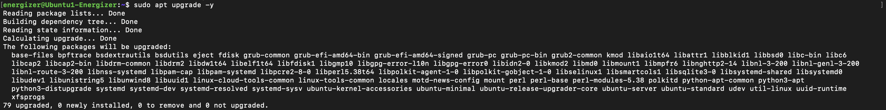

# Linux Management
This repository is for tracking the weekly progress of the Linux Management course in ICT Robotics (BEIRP24A6).

## Assignment 1: Setting Up an Azure Virtual Machine

### Initial Configuration
- Used my existing GitHub account.
- Added my HAMK student email to my GitHub account under Settings > Emails.

### Azure Account Configuration
- Signed up for an Azure account using my HAMK student email at [portal.azure.com](https://portal.azure.com).
- Activated the Azure for Students subscription to gain extra credits.

### Virtual Machine Setup
- **Machine Details:**
  - Image: Ubuntu Server 24.04 LTS gen 2 (Canonical)
  - Name: Ubuntu1-Energizer
  - Size: Standard_B2ls_v2
  - Authentication: SSH key
  - Network: Created a new resource group and subnet
  - Security: Set up to allow SSH traffic from a specific IP

  

### Establishing SSH Connection with Terminal 
- **Connecting via SSH:**
  - Entered to the Native SSH in the Azure portal to connect with the VM
  - Copied the SSH key location to Azzure  and created connecting links using Azure.
  - Launched Terminal.
  - Entered the VM's private key link.
  - Successfully connected to the VM with the specified username.

  

### Verifying the Connection
- Logged into the Ubuntu VM shell successfully.
- Confirmed system access and basic functionality.
- Left system settings at their defaults as instructed.

### Notes
- VM created according to the specifications of the Microsoft Azure course.
- Followed all security best practices.
- Used SSH key authentication for enhanced security.

## Assignment 2: List and append

- Selected five level 2 directories and save their contents in one file, "listing.md"

```sudo ls /etc/{security,selinux,systemd,sos,ssh} > listing.md```

- Listed the files

```cat listing.md```


## Assignment 3: User management and file system access

1. Created the Tupu user using the adduser script:

```sudo adduser tupu```


2. Created the Lupu user using the useradd command. Try to create a user profile, home directory, and user group similar to Tupu.

```sudo useradd -m -d /home/lupu -s /bin/bash -U lupu lupu```


3. Created the Hupu system user with the login shell set to /bin/false

```sudo useradd --system --shell /bin/false hupu```


4. Add the users Tupu and Lupu to the sudo users

```sudo visudo```

and added the folllowing lines

```tupu ALL=(ALL:ALL) ALL```
```lupu ALL=(ALL:ALL) ALL```


And added users to the sudo group with following code:

```sudo usermod -aG sudo tupu```
```sudo usermod -aG sudo lupu```


5. Created a directory /opt/projekti and add both users (Tupu and Lupu) as owners. Only Tupu and Lupu should have access to list files in the directory, read, and modify them.


6. Verified the process


## Assignment 5: 


# Assignment 6: APT Usage Exploration on Linux

## Introduction
This report details practical work with the Advanced Package Tool (APT) on a Linux system, including system updates, package handling, repository management, and troubleshooting strategies.

---

## Part 1: APT Basics & System Updates

### Checking APT Version
**Command used:**
```bash
apt --version
```


### Updating Package Lists
**Command used:**
```bash
sudo apt update
```
**Significance:**
- Syncs local package lists with remote repositories.
- Ensures the system has updated details on available software.
- Necessary before installing or upgrading packages.
- Identifies which packages require updates.


### Upgrading Installed Packages
**Command used:**
```bash
sudo apt upgrade -y
```
**Key Differences Between Update and Upgrade:**
- `apt update` refreshes package metadata.
- `apt upgrade` downloads and installs newer versions of installed packages.
- `update` is like checking for updates, whereas `upgrade` applies them.



### Checking for Pending Updates
**Command used:**
```bash
apt list --upgradable
```
 This command lists upgradeble files

---

## Part 2: Installing & Managing Software

### Searching for a Package
**Command used:**
```bash
apt search image editor
```
**Selected Package:** GIMP (GNU Image Manipulation Program)

### Viewing Package Details
**Command used:**
```bash
apt show gimp
```


**Dependencies:**
- `libc6`
- `libgdk-pixbuf2.0-0`
- `libgegl-0.4-0t64`
- `libgimp2.0t64`
- `libgtk2.0-0t64`

### Installing a Package
**Command used:**
```bash
sudo apt install gimp -y
```
**Verification:** Installation was successful, and the application was launched to confirm functionality.

### Checking Installed Version
**Command used:**
```bash
apt list --installed | grep gimp
```


---

## Part 3: Uninstalling & Cleaning Packages

### Removing a Package
**Command used:**
```bash
sudo apt remove gimp -y
```
**Note:** Removes the software but retains configuration files.

### Completely Purging a Package
**Command used:**
```bash
sudo apt purge gimp -y
```
**Key Differences Between Remove and Purge:**
- `remove` uninstalls the application while keeping settings.
- `purge` deletes both the application and its configuration files.
- `purge` is ideal for completely removing all package traces.

### Removing Unused Dependencies
**Command used:**
```bash
sudo apt autoremove -y
```
**Significance:**
- Deletes packages no longer required by other applications.
- Frees up storage space.
- Helps keep the system clean.

### Clearing the Package Cache
**Command used:**
```bash
sudo apt clean
```
**Purpose:**
- Erases downloaded `.deb` files from the local cache.
- Frees space in `/var/cache/apt/archives/`.
- Does not affect installed programs.

---

## Part 4: Repository Management & Troubleshooting

### Viewing Repository Sources
**Command used:**
```bash
cat /etc/apt/sources.list
```


**Observations:**
- Includes core Ubuntu repositories.
- Contains components: main, restricted, universe, multiverse.
- Lists both source and binary repositories.
- Includes security update repositories.

### Enabling the Universe Repository
**Command used:**
```bash
sudo add-apt-repository universe
sudo apt update
```


**Universe Repository Offers:**
- Community-maintained software.
- Open-source applications not officially supported by Ubuntu.
- A broader selection of packages than the main repository.
- More frequent updates.

### Simulating an Installation Failure
**Command used:**
```bash
sudo apt install fakepackage
```
**Error Message:**


**Troubleshooting Steps:**
- Verify the package name is correct.
- Check if the repository containing the package is enabled.
- Run `apt update` to refresh package indexes.
- Use `apt search` to find similar packages.
- Look for alternative package sources if necessary.

---

## Bonus: Holding & Releasing Packages

### Preventing Automatic Updates
**Commands used:**
```bash
sudo apt-mark hold firefox
sudo apt-mark unhold firefox
```


**Reasons for Holding a Package:**
- Prevents automatic updates of essential software.
- Ensures compatibility with other installed programs.
- Avoids potential issues caused by new updates.
- Maintains a stable working environment.

---

## Conclusion
This assignment provided hands-on experience with APT package management, covering:
- Updating and upgrading the system.
- Installing and removing software.
- Managing repositories.
- Troubleshooting package issues.
- Using advanced package management techniques.

These skills are essential for effectively managing and maintaining Linux-based systems.
# Assignment 7: 


# Assignment 8: 


